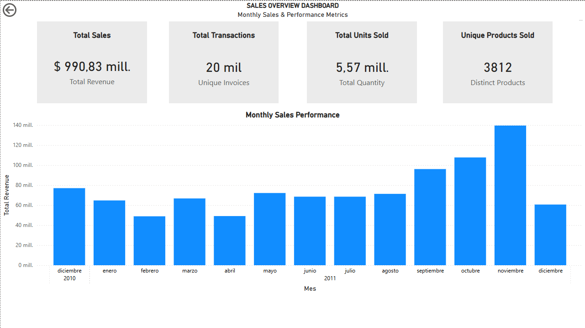

# Sales Overview Dashboard

## Overview
This project presents a **Power BI sales dashboard** to analyze monthly sales performance.  
It provides a clear, interactive view of key metrics and trends to support data-driven decisions.

## Business Problem
The dashboard answers these questions:

- How have total sales evolved month-over-month?  
- Are sales meeting monthly targets?  
- Which products are top performers or underperforming?  
- How many unique transactions occur each month?

Insights from this analysis help guide sales strategy and inventory management.

## Tools
- Microsoft Power BI  
- Python & Jupyter Notebook (for data cleaning)  
- CSV files for input data  

## Dataset
The dataset includes:

- InvoiceNo, StockCode, Description, Quantity, InvoiceDate, UnitPrice, Country  
- Derived fields: MonthYear, Total Revenue, Unique Products, Total Units, Unique Invoices  

## Key Metrics
Dashboard cards:

1. **Total Revenue** – total sales value  
2. **Total Units Sold** – total products sold  
3. **Unique Products Sold** – distinct products sold  
4. **Total Transactions** – number of invoices  

Month-over-Month graph shows revenue and units trends, with optional target comparison.

## Key Insights
- Revenue and units sold fluctuate monthly, reflecting seasonality.  
- A few products drive most of the revenue; others underperform.  
- Peak transaction periods indicate higher customer engagement.  
- Comparing sales vs. targets identifies gaps and opportunities.

## Project Structure
E-commerce-Sales-Performance-Dashboard/
│g
├─ data/
│    ├─ raw/
│    │    └─ Online Retail.xlsx
│    └─ processed/
│         ├─ monthly_summary.csv
│         └─ online_retail_cleaned.csv
│
├─ images/
│    └─ dashboard_screenshot.png     
│
├─ notebooks/
│    └─ data_cleaning_and_preparation.ipynb
│
├─ powerbi/
│    └─ Sales_Dashboard.pbix
│
├─ venv/                               
├─ README.md
└─ requirements.txt

## Visualization

## How to Use
1. Open `powerbi/Sales_Dashboard.pbix` in Power BI Desktop.  
2. Load `data/processed/sales_processed.csv`.  
3. Interact with filters and tooltips to explore insights.

## Next Steps
- Add profit margin or cost analysis  
- Add filters by product category or country  
- Build drill-down and interactive features  
- Automate data updates for the dashboard